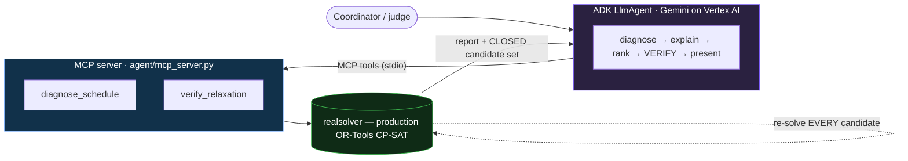

# SchedulerRX · Constraint Debugger Agent

**A neuro-symbolic agent that turns a cryptic CP-SAT `INFEASIBLE` into a plain-English diagnosis — and only ever proposes fixes it has re-verified by re-solving the real production solver.**

[](LICENSE)


> Built for the **Google for Startups AI Agents Challenge** · runs on **Google Cloud Vertex AI** (Gemini) + Cloud Run.

**▶ Live:**  **[See the agent reason — /dev-ui](https://constraint-agent-motlmxvhka-uc.a.run.app/dev-ui)**  ·  **[Before/after demo — /demo](https://constraint-agent-motlmxvhka-uc.a.run.app/demo)**

---

## TL;DR — it diagnosed *and fixed* a real production failure

A live Emergency-Medicine residency program's schedule block (~4 weeks, 14 residents) came back from the shipped product as a flat **`INFEASIBLE`** — no schedule, no actionable reason. We pointed this agent at the real data (read-only). In **~25 seconds / 47 solver re-solves** it:

- isolated the cause to **2 of 14 residents** (proving every other resident's time-off was irrelevant),
- produced **two minimal, solver-*verified* fixes** — decline 2 time-off requests, **or** relax 2 shift targets,
- and ruled out a plausible **red herring** (a data bug that, fixed on its own, doesn't restore feasibility).

The fix was applied; the block solved. → **[Full case study](docs/CASE_STUDY.md).**

## The problem

Constraint solvers are how serious scheduling gets done — residency rotations, nurse rosters, airline crews. When a schedule is over-constrained the solver returns one word, `INFEASIBLE`, on top of output like:

```
INFEASIBLE: 'linear: never in domain' — constraint #3787:
  vars: [1846, 1847, 1855, 1858, 1859]  domain: [6, 7]
```

No human can act on that. In production it's an *engineer's* job to decipher — and the engineer still has to figure out *what to relax* and *whether relaxing it actually helps*. That recurring, expensive pain is what this agent removes.

## What it does

Given an infeasible schedule the agent:

1. **Diagnoses** it — running the real CP-SAT model and explaining, in coordinator English, *why* it can't be solved.
2. **Ranks relaxations** — a closed set the solver itself authored, ordered least- to most-disruptive.
3. **Verifies before recommending** — every fix is **re-solved**; a plausible-but-insufficient one is caught and never presented.
4. **Shows the resulting schedule** once a verified fix is applied.

## Architecture — neuro-symbolic, solver is ground truth



The deterministic solver provides ground-truth feasibility; Gemini provides the human-facing translation and ranking. The symbolic layer **structurally bounds** the LLM — it can only rank candidate IDs the solver authored, and every recommendation is re-solved before a human sees it.

## Two kinds of infeasibility — and why the second one matters

- **Clean gap** — a specific shift no eligible resident can fill. A proto-scan of the model localizes it directly (`agent/diagnostic.py`).
- **Emergent shortfall** — *no single empty cell*; the conflict only exists as the interaction of coverage × availability × per-resident shift targets across the whole block. A static check finds nothing. A **relaxation / IIS search** (`agent/iis.py`) relaxes candidate constraint groups, re-solves, and deletion-filters to the **minimal** binding set — then proves minimality (remove any element → infeasible again). *This is the real production case the toy "find the empty slot" approach can't touch.*

## Why it's safe (the neuro-symbolic guardrail)

1. **Bounded action space** — candidates are generated *by the solver* with stable IDs; the LLM can only rank from that closed set and acts *by ID*, never by parsing prose. A hallucinated ID is dropped.
2. **Every recommendation is re-solved before it is shown** — only feasibility-verified relaxations are presented; a confident-but-wrong suggestion fails the re-solve and is never surfaced.
3. **It abstains / escalates when it can't ground** — a clean gap is localized directly; an emergent one is handed to the IIS search rather than guessed at.

## Why it's innovative

- **Solver as ground truth, every fix verified by re-solving** — not an LLM asserting a fix is good; the optimizer *proves* it. No hallucinated relaxation can be applied or surfaced.
- **IIS search for *emergent* infeasibilities** — finds and proves the *minimal* fix for failures that have no single localizable cause.
- **Generalizes** — the same pattern is a template for explainable optimization in any heavily-regulated scheduling domain (residency, nursing, anesthesia, aviation crew): compliance-as-code.

## Quickstart

```bash
git clone <this repo> && cd schedulerrx-constraint-agent
python3 -m venv .venv && source .venv/bin/activate
pip install -r requirements.txt

python main.py --list                          # known scenarios
python main.py --diagnose em_block_capacity    # emergent case → IIS finds a verified minimal fix
python main.py --diagnose em_block_gap         # clean single-gap case
uvicorn server:app --port 8080                 # then open /dev-ui (agent) and /demo (calendar)

pytest -q                                       # 11 hermetic solver tests (need the snapshot below; skipped without it)
```

> **On the solver snapshot.** The production OR-Tools CP-SAT engine is SchedulerRX's proprietary IP; the deployed build vendors a pinned snapshot under `vendor/` (not included in this open repo). **The open contribution is the agent layer** — the neuro-symbolic architecture, the MCP tools, and the relaxation/IIS search. Because the 11 solver tests import that snapshot, `pytest -q` **skips them with an explanation when it's absent** (they pass in CI / the maintainer's environment). The easiest way to see it end-to-end is the **live links above**.

## Deploy (Cloud Run · Vertex AI)

```bash
./deploy_adk.sh                  # Gemini via Vertex AI (service-account ADC, no API key)
MIN_INSTANCES=1 ./deploy_adk.sh  # pin one warm instance for demo/judging week
```

Auth is the Cloud Run runtime service account (Vertex `aiplatform.user`) — no API key, no free-tier cap.

## Tech stack

| | |
|---|---|
| Solver | OR-Tools **CP-SAT** 9.15 (proto API for ground-truth diagnosis) — production engine, vendored |
| Agent | **Google ADK** 1.15 `LlmAgent` + the prebuilt dev-ui |
| LLM | **Gemini 3.5 Flash** on **Vertex AI** (global endpoint; `GEMINI_MODEL` overridable), auto-retry on transient errors |
| Tools | **MCP** via `fastmcp` over **stdio** (`diagnose_schedule`, `verify_relaxation`, `list_known_scenarios`) |
| Web | FastAPI + uvicorn (`/dev-ui` ADK UI · `/demo` before/after calendar) |
| Deploy | Cloud Run (Vertex AI, scale-to-zero or warm-pinned) |

## Business case

This is the customer-facing infeasibility-explanation layer for **SchedulerRX**, an EM-residency scheduling product with an **active pilot at an EM residency program** and more EM-program demos in the pipeline.

- Healthcare scheduling is heavily **ACGME-regulated**; duty-hour violations carry accreditation and patient-safety consequences. *"Why won't my schedule solve, and what's the safe thing to change?"* is a constant question.
- Today, deciphering a solver failure is engineer-time. This turns it into a self-serve answer a coordinator can act on — **engineer-hours → seconds**, as the case study shows on real data.
- One bounded Gemini call per diagnosis; the heavy lifting is free, deterministic CP-SAT; scale-to-zero. Cost stays flat-to-trivial across programs and blocks.

## Repository layout

```
agent/
  realsolver.py    builds + solves the real CP-SAT model; diagnose (proto-scan → IIS fallback) + verify
  iis.py           relaxation / IIS search for emergent infeasibilities (minimal binding set, proven)
  diagnostic.py    proto-scan ground truth (forced-false vars, unsatisfiable coverage linears)
  model.py         CP-SAT model primitives shared by the diagnostic proto-scan
  mcp_server.py    MCP tools (fastmcp, stdio) the agent drives
  adk_agent.py     the ADK LlmAgent (Gemini on Vertex) + McpToolset
adk_app/           ADK app package (root_agent) for `adk web` / get_fast_api_app
server.py          Cloud Run entry — ADK dev-ui (/dev-ui) + the /demo calendar
main.py            local CLI (diagnose / verify against the real solver)
vendor/            pinned proprietary solver snapshot (NOT in the open repo)
tests/             hermetic solver tests (no DB, no network, no LLM)
docs/CASE_STUDY.md the real production-failure write-up
deploy_adk.sh · Dockerfile · requirements.txt
```

## License

MIT — see [LICENSE](LICENSE).
