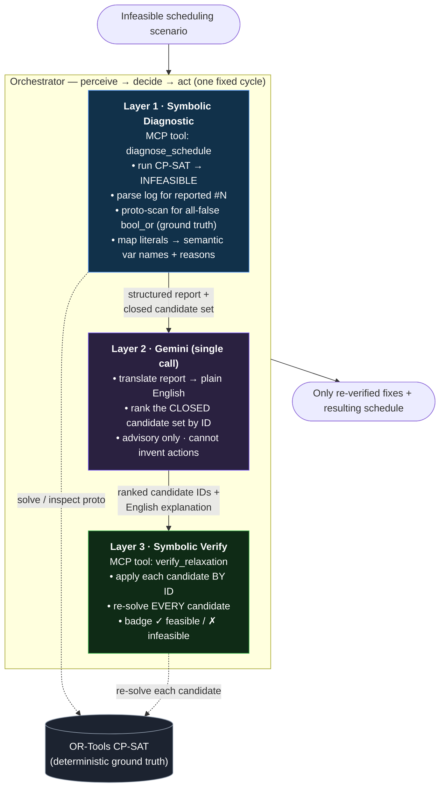

# Architecture diagram

Required submission artifact. Two renderings below: a Mermaid diagram (renders inline
on GitHub) and an ASCII version. For a PNG to attach on Devpost, paste the Mermaid
source into <https://mermaid.live> and export, or screenshot the GitHub render.

## Mermaid



## ASCII

```
            Infeasible scheduling scenario
                          │
        ┌─────────────────▼─────────────────────────────────────┐
        │  ORCHESTRATOR  (perceive → decide → act, one cycle)     │
        │                                                         │
        │  ┌───────────────────────────────────────────────┐     │
        │  │ L1  SYMBOLIC DIAGNOSTIC   [MCP diagnose_schedule]│    │     run / inspect
        │  │  run CP-SAT → INFEASIBLE                         │────┼────────────────────┐
        │  │  parse log #N  +  proto-scan all-false bool_or   │    │                    │
        │  │  literals → semantic names + block reasons       │    │                    ▼
        │  └───────────────────┬──────────────────────────────┘   │           ┌──────────────────┐
        │      report + CLOSED candidate set                       │           │  OR-Tools CP-SAT │
        │  ┌───────────────────▼──────────────────────────────┐   │           │  (ground truth)  │
        │  │ L2  GEMINI  (single call)                         │   │           └──────────────────┘
        │  │  English explanation + rank candidate IDs         │   │                    ▲
        │  │  advisory · bounded to the closed set             │   │                    │
        │  └───────────────────┬──────────────────────────────┘   │                    │
        │      ranked IDs + explanation                            │     re-solve each  │
        │  ┌───────────────────▼──────────────────────────────┐   │                    │
        │  │ L3  SYMBOLIC VERIFY      [MCP verify_relaxation]   │───┼────────────────────┘
        │  │  apply each candidate BY ID · re-solve EVERY one   │   │
        │  │  badge ✓ feasible / ✗ infeasible                   │   │
        │  └───────────────────┬──────────────────────────────┘   │
        └────────────────────── │ ────────────────────────────────┘
                                ▼
              Only re-verified fixes + resulting schedule
```

**Key property:** the LLM (L2) sits *between* two symbolic layers. L1 bounds what it can
talk about (a closed candidate set with stable IDs); L3 re-solves whatever it ranks
before anything reaches the user. Hallucination cannot escape the sandwich.
